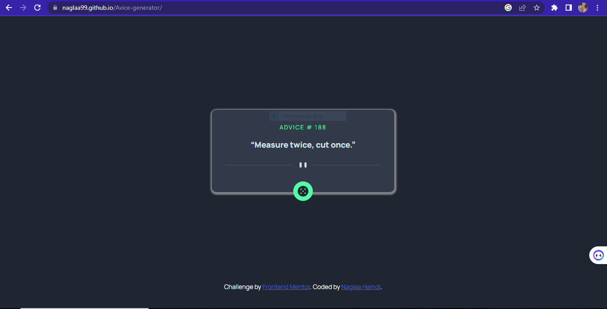

# Frontend Mentor - Advice generator app solution
<h3>An app that generates random advices...</h3>

This is a solution to the [Advice generator app challenge on Frontend Mentor](https://www.frontendmentor.io/challenges/advice-generator-app-QdUG-13db). Frontend Mentor challenges help you improve your coding skills by building realistic projects.

## Overview

### The challenge

Users should be able to:

- View the optimal layout for the app depending on their device's screen size
- See hover states for all interactive elements on the page
- Generate a new piece of advice by clicking the dice icon
### Screenshot

<h3>Technologies Used:</h3>
<ol>
  <li>HTML</li>
  <li>CSS</li>
  <li>Bootstrap</li>
  <li>JS</li>
  <li>API</li>
</ol>

<h3>

  

  
### Links

- Solution URL: [https://github.com/Naglaa99/Avice-generator](https://github.com/Naglaa99/Avice-generator)
- Live Site URL: [https://naglaa99.github.io/Avice-generator/](https://naglaa99.github.io/Avice-generator/)

